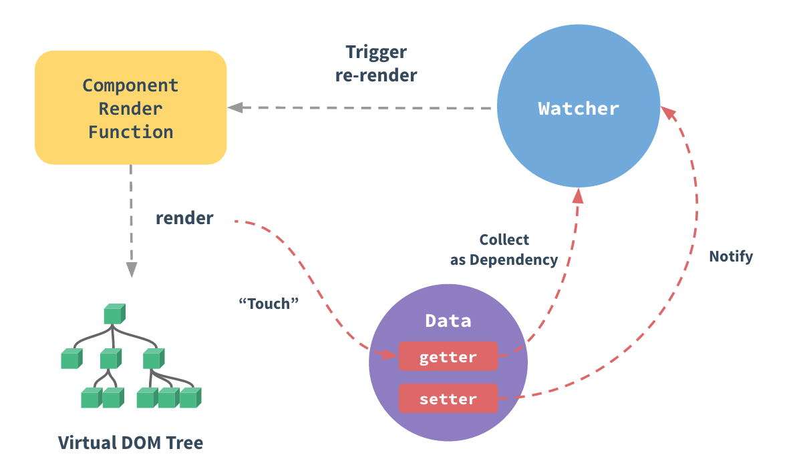
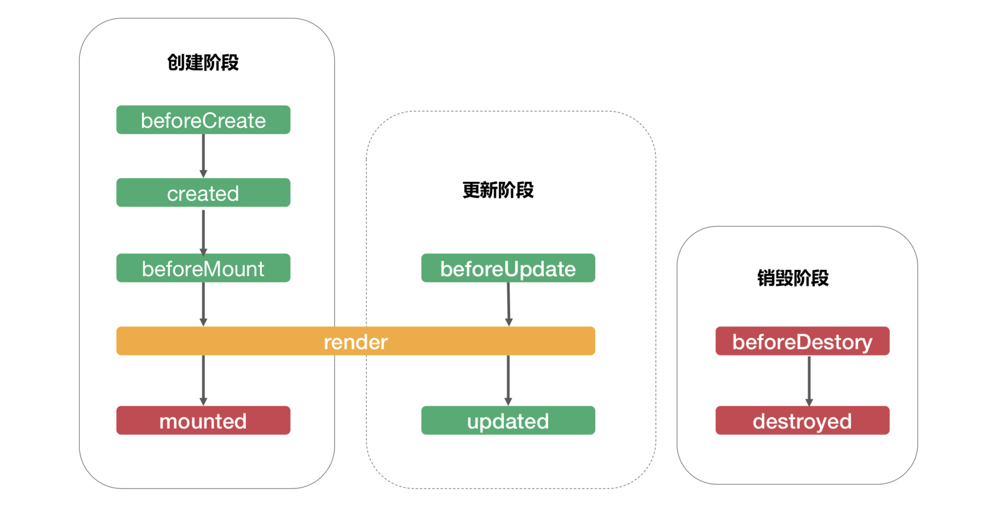
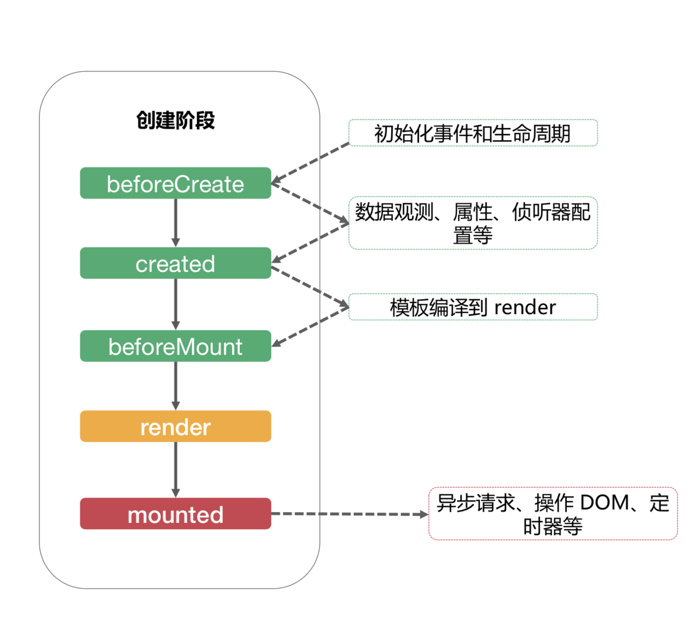
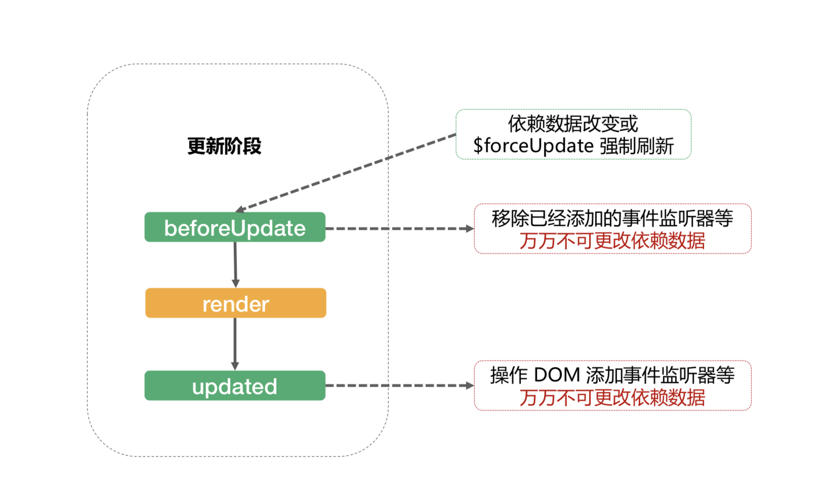
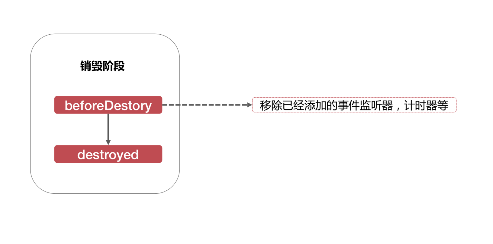

# 属性
- 自定义属性 props
`组件props中声明的属性`
- 原生属性 attrs
`没有声明的属性，默认自动挂载到组件根元素上, 设置inheritAttrs 为 false 可以关闭自动挂载`
- 特殊属性 class style
`挂载到组件根元素上, 支持字符串、对象、数组等多种语法`

---

# 事件
- 普通事件
`@click, @input, @change, @xxx等事件通过this.$emit('xxx', ....)触发`
- 修饰符事件
`@input.trim, @click.stop, @submit.prevent等, 一般用于原生HTML元素, 自定义组件需要自行开发支持`

---

# 插槽
- 普通插槽
```
<template slot="xxx">...</template>
推荐：<template v-slot:xxx>...</template>
```
- 作用域插槽
```
<template slot="xxx" slot-scope="props">...</template>
推荐：<template v-slot:xxx="props">...</template>
```
 ---

 # 大属性
 - 属性
    1. 自定义属性 props
    2. 原生属性 attrs
    3. 特殊属性 class、style
 - 事件
    1. 普通事件
    2. 修饰符事件
 - 插槽
    1. 普通插槽
    2. 作用域插槽

---

# 双向绑定 or 单向数据流
- Vue是单向数据流，并不是双向绑定
- Vue的双向绑定不过是语法糖
- Object.defineProperty是用来做响应式更新的，和双向绑定没关系

---

# 数据来源（单向的）
- 来自父元素的属性
- 来自组件自身的状态 data
- 来自状态管理器 如vuex，Vue.observable

---

# 状态 data vs 属性 props
- 状态是组件自身的数据
- 属性是来自父组件的数据
- 状态的改变未必会触发更新
- 属性的改变未必会触发更新

---

# 响应式更新


---

# 计算属性 computed
- 减少模板中计算逻辑
- 数据缓存
- 依赖固定的数据类型（响应式数据）

---

# 侦听器 watch
- 更加灵活、通用
- watch 中可以执行任何逻辑，如函数节流，Ajax异步获取数据，甚至操作 DOM

---

# computed vs watch
- computed 能做的，watch 都能做，反之则不行
- 能用 computed 的尽量用 computed 

---

# 生命周期


- 创建阶段

- 更新阶段

- 销毁阶段


---

# 函数式组件
- functional:true
- 无状态、无实例、没有this上下文、无生命周期

---

